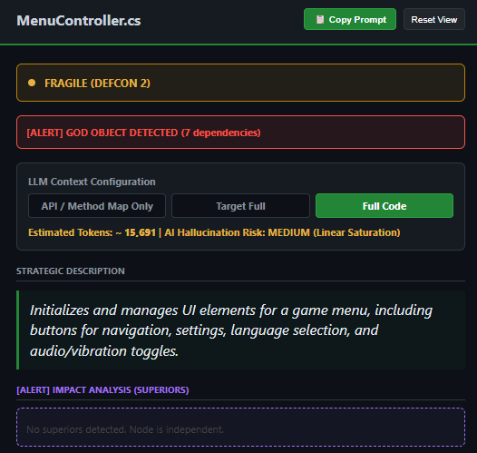
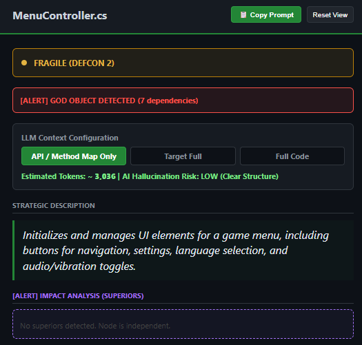

# PanzaScope (v1.0.0)
 <p align="center">
  <a href="https://github.com/Panzadabira/PanzaScope"></a>
  <a href="https://www.python.org/downloads/"></a>
  <a href="https://ollama.com"></a>
  <a href="https://assetstore.unity.com/packages/tools/utilities/panzascope-ai-dependency-mapper-380466"></a>
  <a href="https://opensource.org/licenses/MIT"></a>
  <a href="https://github.com/Panzadabira/PanzaScope/pulls"></a>
</p>

### *Universal Polyglot Architecture Mapping & Static Analysis Engine*

Spaghetti code kills projects. Bloated context kills AI. 

**PanzaScope** fixes both.

​Stop feeding raw scripts to your LLMs. PanzaScope visualizes complex dependencies in milliseconds and extracts logic-stripped JSON blueprints, saving you hours of refactoring and up to 60% in token waste depending on the context you choose to copy.


<p align="center">
  
</p>

### Open-Source Collaboration
This project is a labor of love and a testament to the power of open-source collaboration. I welcome contributions from developers, researchers, and enthusiasts across all levels of expertise. Whether you have a bug fix, a new feature, or just want to share your thoughts, check the Issues tab for open tasks or open a new one to propose a feature.

---

## Core Features

### Interactive Architecture Visualization
Generates two complementary outputs from a single scan:
- an interactive, hardware-accelerated HTML dependency map (Planetarium) for human exploration;
- a lightweight `_LLM_Payload.json` blueprint optimized for AI assistants.

This separates visual analysis from machine-readable context, allowing both humans and LLMs to work with the same project efficiently.

<br>

<table align="center" style="border-collapse: collapse; border: none;">
  <tr>
    <td align="center" width="50%"><b>🌌 Planetarium: Full Project Cosmology</b></td>
    <td align="center" width="50%"><b>🎯 System Focus: Node Inspection</b></td>
  </tr>
  <tr>
    <td align="center"></td>
    <td align="center"></td>
  </tr>
</table>

---

### Optimized AI Context Extraction
Reduces context window usage by removing implementation details while preserving project structure.

The generated blueprint contains:
- files and dependencies
- class hierarchies
- methods and signatures
- HTML DOM structure (IDs, Classes, Tags)
- architectural relationships

This provides LLMs with the information needed to understand the codebase while significantly reducing token usage.

---

### The Proof: 60-80% Token Reduction
Notice how switching from **Full Code** to **API / Method Map Only** drops the token count from ~15,600 to ~3,000, shifting the AI hallucination risk from MEDIUM to LOW.

<table align="center" style="border-collapse: collapse; border: none;">
  <tr>
    <td align="center" width="50%"><b>🔴 Traditional: Full Code Payload</b></td>
    <td align="center" width="50%"><b>🟢 PanzaScope: Eco-Scan Blueprint</b></td>
  </tr>
  <tr>
    <td align="center"></td>
    <td align="center"></td>
  </tr>
</table>

---

### Local-First AI Integration
Built to work natively with Ollama and models such as `qwen2.5-coder:7b`.

Analyze proprietary or commercial codebases entirely offline:
- zero cloud uploads
- zero API costs
- zero data leaks
- low latency

---

### Coupling & Stability Analysis
Continuously evaluates dependency density and architectural health.

Projects are classified into three risk levels:

🟢 Stable — low coupling and modular architecture

🟡 Fragile — increasing dependency propagation

🔴 Critical — high coupling with elevated regression risk

---

### God Object Detection
Highlights classes or components with an unusually high number of direct dependencies (≥7), helping identify potential architectural bottlenecks before they become maintenance problems.

---

### Safe Recursive Scanning
Automatically ignores generated reports and output folders, preventing recursive scans and infinite processing loops.

---

### Incremental Scanning
Uses file metadata to skip unchanged files, dramatically reducing scan time while enabling instant browser hot-reloading during development.

---

## Cosmology & Layer Color Legend

The *Planetarium* map uses custom orbital geometries and distinct colors to represent project taxonomic layers:
* 🟣 **L0 (Contracts):** Decoupled abstractions, interfaces, and API contracts.
* 🔵 **L1 (Data/DNA):** Serialized configurations, JSON nodes, ScriptableObjects, and style sheets (USS/CSS).
* 🟠 **L2 (Core Systems):** Global orchestrators, central managers, and network controllers.
* 🟢 **L3 (Logic):** Distinct operational scripts, gameplay loops, and business logic.
* 🔴 **L4 (UI Layouts):** Visual panels, Canvas components, and layout hierarchies.

---

## Getting Started

### Prerequisites
* **Python 3.10+**
* **requests** library
* **Ollama** (Highly recommended for local offline AI assistance)

## Installation & Run

**Clone the repository**

```bash
git clone https://github.com/Panzadabira/PanzaScope.git
cd PanzaScope
```

**Install dependencies**

```bash
pip install -r requirements.txt
```

**Launch the model (Optional for local AI analysis)**

```bash
ollama pull qwen2.5-coder:7b
ollama serve
```

**Run the tool**

```bash
python main.py
```

   ---

### The Panza Labs Ecosystem
This repository serves as the core open-source engine of PanzaScope. If you are developing complex gamedev pipelines and want a frictionless, unified workflow:

PanzaScope for Unity Editor
Available for 42.00 CHF — the ultimate answer to Life, the Universe, and your spaghetti code architecture.

The Premium Unity Asset integrates the Planetarium graph directly inside Unity as a native Editor Window (using UI Toolkit), featuring automatic hot-reloads on script saves, custom editor layouts, and instant one-click pinging of files in the project Inspector.

The core engine remains free and open-source. If you find PanzaScope valuable, consider supporting its long-term development by purchasing the Premium Unity Editor Integration.
https://assetstore.unity.com/packages/tools/utilities/panzascope-ai-dependency-mapper-380466

___


⚖️ **License: Distributed under the MIT License.**

Built with passion for developers by Panza Labs.
