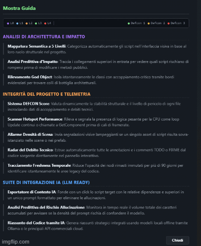

# PanzaScope (v1.0.0)
### *Universal Polyglot Architecture Mapping & Static Analysis Engine*

**PanzaScope** is a standalone, polyglot static analysis suite designed for **zero-latency architectural mapping** of complex codebases (Unity/C#, Python, Java, C++, HTML, UXML, USS, CSS, JS). It transforms raw directory structures into an interactive **cosmological relational graph** (the *Planetarium*), while surgically optimizing context payloads for Local and Cloud LLMs through our proprietary **Eco-Scan protocol**, slashing token waste by up to **60%**.

  

### Open-Source Collaboration
This project is a labor of love and a testament to the power of open-source collaboration. I welcome contributions from developers, researchers, and enthusiasts across all levels of expertise. Whether you have a bug fix, a new feature, or just want to share your thoughts, check the Issues tab for open tasks or open a new one to propose a feature.

---

## Core Features

* **Dual-Stream Architecture:** Decouples human visual telemetry from machine analysis. Generates a gorgeous, hardware-accelerated interactive HTML report (*Planetarium*) and a highly compressed, syntax-stripped JSON blueprint (`_LLM_Payload.json`) for AI context injection.
* **Eco-Scan Protocol (Blueprint Extraction):** Prevents context window saturation. Strips logic method bodies and extracts structural DOM hierarchies (IDs, Classes, Tags), preserving the system's behavioral signature at a fraction of the token cost.
* **Privacy-First Ollama Integration:** Built natively to interface with `qwen2.5-coder:7b`. Analyze commercial-grade proprietary codebases **entirely offline** on your local machine with zero data leaks, zero latency, and zero token costs.
* **DEFCON Telemetry Matrix:** Evaluates system stability and coupling density in real-time:
  * 🟢 **DEFCON 1 (Stable):** Low coupling, modular hierarchy.
  * 🟡 **DEFCON 2 (Fragile):** Moderate dependency propagation.
  * 🔴 **DEFCON 3 (Critical):** High risk of systemic regression.
* **God Object Shield:** Automatically highlights structural monoliths ($\ge 7$ direct dependencies) with heavy node borders to prevent cascading bugs.
* **Anti-Ouroboros Protection:** Safeguards scanning pipelines from recursive loops by dynamically isolating generated outputs.
* **Delta Engine & Hot-Reload:** Bypasses redundant scans via file metadata, enabling immediate browser hot-reloading.

---

## Cosmology & Layer Color Legend

The *Planetarium* map uses custom orbital geometries and distinct colors to represent project taxonomic layers:
* 🟣 **L0 (Contracts):** Decoupled abstractions, interfaces, and API contracts.
* 🔵 **L1 (Data/DNA):** Serialized configurations, JSON nodes, ScriptableObjects, and style sheets (USS/CSS).
* 🟠 **L2 (Core Systems):** Global orchestrators, central managers, and network controllers.
* 🟢 **L3 (Logic):** Distinct operational scripts, gameplay loops, and business logic.
* 🔴 **L4 (UI Layouts):** Visual panels, Canvas components, and layout hierarchies.

---

## Getting Started

> **🛑 DevTools bottleneck?**
> Tired of Alt-Tabbing between the terminal and Unity?
> **Get PanzaScope for Unity Editor (Native Integration)**
> *Hot-Reload, Inspector Ping, and Native UI Toolkit Integration.*

### Prerequisites
* **Python 3.10+**
* **requests** library
* **Ollama** (Highly recommended for local offline AI assistance)

## Installation & Run

**Clone the repository**

'''bash
git clone https://github.com/Panzadabira/PanzaScope.git
cd PanzaScope
'''

**Install dependencies**

'''bash
pip install -r requirements.txt
'''

**Launch the model (Optional for local AI analysis)**

'''bash
ollama pull qwen2.5-coder:7b
ollama serve
'''

**Run the tool**

'''bash
python main.py
'''

   ---

### The Panza Labs Ecosystem
This repository serves as the core open-source engine of PanzaScope. If you are developing complex gamedev pipelines and want a frictionless, unified workflow:

PanzaScope for Unity Editor
Available for 42.00 CHF — the ultimate answer to Life, the Universe, and your spaghetti code architecture.

The Premium Unity Asset integrates the Planetarium graph directly inside Unity as a native Editor Window (using UI Toolkit), featuring automatic hot-reloads on script saves, custom editor layouts, and instant one-click pinging of files in the project Inspector.

The core engine remains free and open-source. If you find PanzaScope valuable, consider supporting its long-term development by purchasing the Premium Unity Editor Integration.
[https://assetstore.unity.com/packages/tools/utilities/panzascope-ai-dependency-mapper-380466]

___

## Base File Architecture
**main.py**: Hardened entrypoint.

**Panza_UI.py**: Interactive hub (Tkinter) with GitHub Dark aesthetics.

**Panza_Generator.py**: Pipeline coordinator.
**Panza_Analyzer.py**: Extensible static analysis hub (Strategy Pattern).

**PanzaTemplate.html**: High-performance canvas view (Glassmorphism & Vis.js).

**processors/**: The extensible heart — add new language processors here!

⚖️ **License: Distributed under the MIT License.**

Built with passion for developers by Panza Labs.
